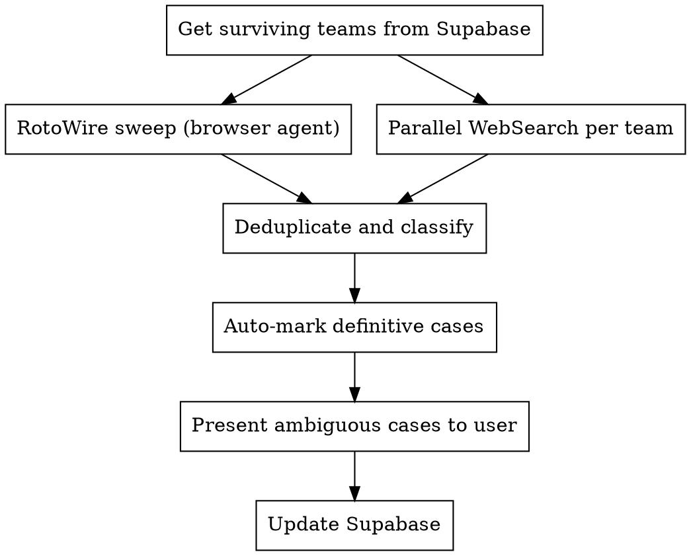

# Injury Report

Search for injured, suspended, or ineligible players across surviving tournament teams. Auto-marks definitively out players and presents ambiguous cases for human confirmation.

## Process



## Step 1: Get Surviving Teams

```python
teams = supabase.table("team_competition") \
    .select("team_unique") \
    .eq("competition_id", comp_id) \
    .is_("round_eliminated", "null") \
    .execute()
```

Only check teams still alive in the tournament.

## Step 2: RotoWire Sweep

Dispatch ONE browser agent to fetch the full RotoWire injury page:

```
Use superpowers-chrome:browser-user subagent to:
1. Go to https://www.rotowire.com/cbasketball/injury-report.php
2. Extract ALL players with status "Out", "Out For Season", or "Out Indefinitely"
3. For each: player name, team, status, injury description, expected return
4. Filter to only tournament teams (provide the list of surviving team names)
```

RotoWire loads via JavaScript — WebFetch will not work. Must use browser tool.

## Step 3: Parallel Web Searches

Dispatch parallel WebSearch agents (NOT browser) for each surviving team:

```
Search: "NCAA {team_name} injuries out suspended 2026 tournament"
```

WebSearch works without JS rendering and catches things RotoWire might miss: suspensions, transfers, academic eligibility, arrests.

## Step 4: Classify Results

### Auto-Mark (definitively out — no confirmation needed)

Mark `inactive = true` immediately when status contains ANY of:
- "out for season" / "out for the season"
- "season-ending" (surgery, injury, etc.)
- "ACL" combined with "out" or "tear"
- "dismissed from team" / "no longer with team"
- "transferred"
- "suspended indefinitely"

### Ask User (ambiguous — requires confirmation)

Present to user with evidence when status contains:
- "out" (without "for season")
- "suspended" (without "indefinitely")
- "doubtful" (only if user wants aggressive marking)
- Any case where the language is unclear

### Never Mark (skip entirely)

- "questionable"
- "day-to-day"
- "probable"
- "game-time decision"
- "expected to play"

## Step 5: Update Supabase

For each confirmed inactive player:

```python
supabase.table("player_competition").update({
    "inactive": True,
    "note": f"{reason} ({source} {date})"
}).eq("player_unique", player_id).eq("competition_id", comp_id).execute()
```

The `note` field records the reason and source for auditability:
- `"ACL tear - out for season (RotoWire 2026-03-22)"`
- `"Suspended - felony charge (ESPN 2026-03-19)"`
- `"Fractured foot - out indefinitely (CBS Sports 2026-03-20)"`

## Step 6: Report Summary

After all updates, print a summary:

```
Injury Report - 2026-03-22
==========================
Auto-marked inactive (definitively out):
  jt-toppin-1 (texas-tech): ACL tear - out for season
  richie-saunders-1 (brigham-young): ACL tear - out for season
  caleb-foster-2 (duke): Fractured foot - out indefinitely

Marked inactive (user confirmed):
  aden-holloway-2 (alabama): Suspended - felony charge

Skipped (questionable/day-to-day):
  patrick-ngongba-2 (duke): Foot soreness - questionable

No changes:
  [teams with no injury concerns]
```

## Player Name Matching

Use the same team-based prefix lookup as record-scores:

```python
# Build lookup from player_competition
players = supabase.table("player_competition") \
    .select("player_unique, team_unique") \
    .eq("competition_id", comp_id) \
    .execute()

roster_lookup = {}  # {team: {name_prefix: player_unique}}
for p in players.data:
    team = p['team_unique']
    pid = p['player_unique']
    prefix = '-'.join(pid.rsplit('-', 1)[:-1])
    if team not in roster_lookup:
        roster_lookup[team] = {}
    roster_lookup[team][prefix] = pid
```

Match injury report names to player_unique using BOTH name AND team context. Never guess suffix numbers.

## Common Team Name Mismatches

Injury sources use different team names than our database:

| Source Name | Database team_unique |
|-------------|---------------------|
| UConn | connecticut |
| BYU | brigham-young |
| UCF | central-florida |
| SMU | southern-methodist |
| UMBC | maryland-baltimore-county |
| St. John's | st-johns-ny |
| St. Mary's | saint-marys-ca |
| Miami (FL) | miami-fl |
| Miami (OH) | miami-oh |
| NC State | north-carolina-state |
| LIU | long-island-university |

## When to Run

- **Before Draft 1** — check all 68 teams for pre-tournament injuries
- **Before Draft 2** — check surviving teams for new injuries from earlier rounds
- **Mid-tournament** — anytime you want to update injury status for roster maintenance
- **After a game** — if a player gets injured during a game, mark them for future rounds
