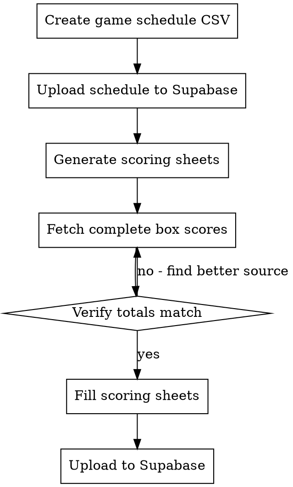

# Record Tournament Game Scores

Record player-level scoring data from NCAA tournament games into Supabase. Covers the full pipeline: schedule → scoring sheet → box scores → verification → upload.

## Process



## Step 1: Game Schedule

Create a CSV at `data/output/{year}/schedules/game-schedule-round-{N}-{year}-ncaa-tournament.csv`:

```csv
game_date,team_1_id,team_2_id,game_time,round_num,competition_id
2026-03-17,howard,maryland-baltimore-county,18:40,1,8
```

- `team_1_id` and `team_2_id` use lowercase sportsipy abbreviations (same as `team_unique` in Supabase)
- `game_time` is tip-off in HH:MM ET
- Upload via: `supabase.table("game").upsert(rows).execute()`

**GET TIP-OFF TIMES RIGHT THE FIRST TIME.** Use the browser tool to fetch exact times from ESPN before creating the CSV. Game times are part of the upsert key — changing them later creates new game_ids, which invalidates scoring sheets and requires regeneration. Create the full round's schedule at once (e.g., all 32 Round of 64 games for both days).

## Step 2: Generate Scoring Sheets

Query `players_in_games_view` for the game date to get all rostered players:

```python
data = supabase.table("players_in_games_view") \
    .select("*").eq("game_date", date).eq("competition_id", comp_id).execute()
df = pd.DataFrame(data.data)
df['points'] = None
df['lost'] = None
df['inactive'] = None
df.to_csv(path, columns=['game_time','team_unique','lost','player_unique','points','inactive','game_id'])
```

This pre-populates ALL rostered players (13-17 per team). Players who don't play get 0 points.

## Step 3: Fetch Box Scores

**USE THE BROWSER TOOL.** Sports sites render box scores via JavaScript — WebFetch only gets empty page shells.

```
Use superpowers-chrome:browser-user subagent to:
1. Search Google for "ESPN {team1} {team2} box score {date} {year}"
2. Navigate to ESPN box score page
3. Extract every player's points from the rendered stats table
```

**Parallelize box score fetching** — dispatch multiple browser subagents for different games simultaneously (2-3 games per agent works well). Each agent should verify its own totals before returning.

**Partial day recording** — if only some games are final, fetch and upload only those. Leave unplayed games blank in the scoring sheet. The scoring sheet covers the full day; you fill in games as they complete and re-run upload for newly finished games.

### Source Reliability

| Source | Completeness | JS Required | Notes |
|--------|-------------|-------------|-------|
| ESPN box score | Complete | Yes | Best source — all players who dressed |
| Official athletic sites | Complete | Yes | Good backup — check both teams' sites |
| Yahoo Sports | Complete | Yes | Alternative to ESPN |
| Fox Sports | **INCOMPLETE** | Yes | Missing bench players, wrong point values |
| CBS Sports live blogs | **INCOMPLETE** | No | Only highlights, not full stats |
| Web search snippets | **INCOMPLETE** | No | Only star players mentioned |

**NEVER trust Fox Sports box scores or search result snippets as the sole source.** They routinely omit bench players and show incorrect point values.

## Step 4: Verify Before Uploading

**MANDATORY: Player points must sum to the actual game score.**

```python
# For each game, verify:
team_1_total = sum(points for players on team_1)
team_2_total = sum(points for players on team_2)
assert team_1_total == actual_score_team_1, f"Mismatch: {team_1_total} vs {actual_score_team_1}"
assert team_2_total == actual_score_team_2, f"Mismatch: {team_2_total} vs {actual_score_team_2}"
```

If totals don't match, find a more complete box score source. Common causes:
- Missing bench players who scored
- Wrong point values from incomplete sources
- Players on roster but not in box score (these get 0, which is correct)

**Player name → player_unique mapping:** Box scores use display names ("Cameron Boozer") but the database uses IDs ("cameron-boozer-3"). Read the scoring sheet first to get the list of player_unique values per team, then map box score names to IDs. Most map directly (lowercased, hyphenated). Watch for suffix numbers — some players share names across teams (e.g., "-1", "-2", "-3").

## Step 5: Upload to Supabase

Three operations per game day:

```python
# 1. Record player scores
player_game_rows = [{"player_unique": p, "game_id": g, "points": pts} for ...]
supabase.table("player_game").upsert(
    player_game_rows, ignore_duplicates=False, on_conflict="game_id, player_unique"
).execute()

# 2. Record competition progress
supabase.table("competition_updated").insert({
    "competition_id": comp_id, "current_round": round_num
}).execute()

# 3. Mark eliminated teams
for team in losing_teams:
    supabase.table("team_competition").update({
        "round_eliminated": round_num
    }).eq("team_unique", team).eq("competition_id", comp_id).execute()

# 4. Mark inactive/injured players (if any)
for player in inactive_players:
    supabase.table("player_competition").update({
        "inactive": True
    }).eq("player_unique", player).eq("competition_id", comp_id).execute()
```

## Scoring Sheet CSV Format

```csv
game_time,team_unique,lost,player_unique,points,inactive,game_id
18:40,howard,,ose-okojie-1,23,,453
18:40,howard,,bryce-harris-1,19,,453
18:40,maryland-baltimore-county,L,jahlikai-king-1,19,,453
```

- `lost`: `L` for losing team players, empty for winners
- `inactive`: `I` for injured/inactive players, empty otherwise
- `points`: integer, 0 for players who didn't play

## File Locations

- Schedules: `data/output/{year}/schedules/game-schedule-round-{N}-{year}-ncaa-tournament.csv`
- Scores: `data/output/{year}/scores/{date}-game-scoring-{year}-ncaa-tournament.csv`
- Config: `data/seasons/{year}.toml` (has competition_id)

## Key Database Tables

| Table | Purpose |
|-------|---------|
| `game` | Game schedule (teams, date, time, round) |
| `players_in_games_view` | View joining players to their team's games |
| `player_game` | Individual player scores per game |
| `team_competition` | Team tournament status (round_eliminated) |
| `player_competition` | Player status (inactive flag) |
| `competition_updated` | Tracks which round scores are current through |

## Round Numbers

| Round | Name | Typical Dates |
|-------|------|---------------|
| 1 | First Four | Tue-Wed before Round of 64 |
| 2 | Round of 64 | Thu-Fri |
| 3 | Round of 32 | Sat-Sun |
| 4 | Sweet 16 | Thu-Fri (week 2) |
| 5 | Elite Eight | Sat-Sun (week 2) |
| 6 | Final Four | Saturday |
| 7 | Championship | Monday |

## Common Mistakes

| Mistake | Fix |
|---------|-----|
| Guessing tip-off times | Use browser tool to get exact times from ESPN BEFORE creating schedule CSV |
| Changing game times after schedule upload | Creates new game_ids, invalidates scoring sheets — get times right first |
| Trusting Fox Sports or search snippets | Use ESPN box scores via browser tool — only source with complete player stats |
| Uploading without verifying totals | ALWAYS check that player points sum to actual game score before uploading |
| Recording all games at once | OK to record partial days — only upload games that are FINAL |
| Forgetting to mark eliminated teams | Every losing team must be marked with `round_eliminated` after upload |
| Not creating schedule before scoring sheet | Scoring sheets depend on game_ids from the schedule — schedule must exist first |
