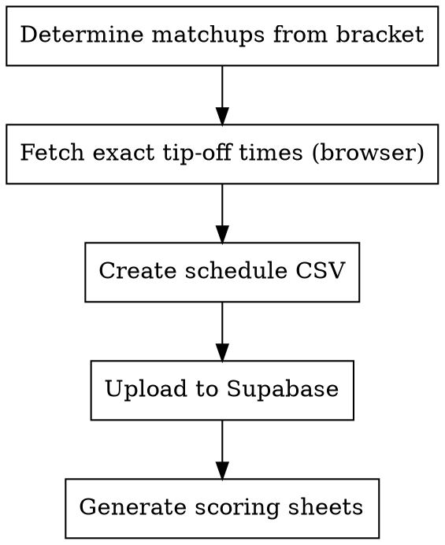

# Schedule Games

Set up game schedules for a tournament round. Creates the schedule CSV with verified tip-off times, uploads to Supabase, and generates blank scoring sheets.

## Process



## Step 1: Determine Matchups

Query Supabase for surviving teams and their seeds to build the bracket matchups:

```python
from pipeline.supabase_client import get_client
supabase = get_client()

# Get surviving teams
teams = supabase.table("team_competition") \
    .select("team_unique, seed, region") \
    .eq("competition_id", comp_id) \
    .is_("round_eliminated", "null") \
    .execute()
```

Matchups follow the bracket — winners from the previous round play each other based on seed position. Check the ESPN bracket if unsure which teams play which.

## Step 2: Fetch Exact Tip-Off Times

**GET TIMES RIGHT THE FIRST TIME.** Changing times later creates new game_ids and invalidates scoring sheets.

Use the browser tool to get exact tip-off times from ESPN:

```
Use superpowers-chrome:browser-user subagent to:
1. Search "ESPN NCAA tournament schedule [date] 2026"
2. Extract each game's tip-off time in ET (HH:MM format)
3. Note the TV network for reference
```

If games span two days (e.g., Sweet 16 on Thursday and Friday), get ALL games in one search and create the full round's schedule at once.

## Step 3: Create Schedule CSV

Write to `data/output/{year}/schedules/game-schedule-round-{N}-{year}-ncaa-tournament.csv`:

```csv
game_date,team_1_id,team_2_id,game_time,round_num,competition_id
2026-03-26,duke,michigan-state,19:10,4,8
```

**Rules:**
- `team_1_id` and `team_2_id` use lowercase sportsipy abbreviations (same as `team_unique` in Supabase)
- `game_time` is tip-off in HH:MM ET (24-hour format)
- Higher seed is typically `team_1_id` but this is not enforced
- Include ALL games for the round across all dates

## Step 4: Upload to Supabase

Use the pipeline function:

```python
from pipeline.game_recording import update_game_schedule
update_game_schedule(
    "output/2026/schedules/game-schedule-round-4-2026-ncaa-tournament.csv",
    supabase,
)
```

Verify the upload by checking game_ids:

```python
games = supabase.table("game") \
    .select("game_id, team_1_id, team_2_id, game_time, game_date") \
    .eq("round_num", round_num) \
    .eq("competition_id", comp_id) \
    .order("game_date") \
    .order("game_time") \
    .execute()
```

**Check for duplicates.** If the round was partially uploaded before with different times, old game records may remain. Delete them before uploading:

```python
# Find and remove duplicate games for this round
old = supabase.table("game") \
    .select("game_id") \
    .eq("round_num", round_num) \
    .eq("competition_id", comp_id) \
    .execute()
# Only delete if they have no player_game scores attached
```

## Step 5: Generate Scoring Sheets

For each game date in the round:

```python
from pipeline.game_recording import generate_game_scoring_sheet
path = generate_game_scoring_sheet(
    date="2026-03-26",
    competition_id=8,
    year=2026,
    data_dir="output/2026",
    supabase=supabase,
)
```

Or manually:

```python
import pandas as pd
data = supabase.table("players_in_games_view") \
    .select("*").eq("game_date", date).eq("competition_id", comp_id).execute()
df = pd.DataFrame(data.data)
df['points'] = None
df['lost'] = None
df['inactive'] = None
df.to_csv(path, index=False,
    columns=['game_time','team_unique','lost','player_unique','points','inactive','game_id'])
```

## Round Schedule Reference

| Round | Name | Games | Typical Days |
|-------|------|-------|-------------|
| 1 | First Four | 4 | Tue-Wed |
| 2 | Round of 64 | 32 | Thu-Fri |
| 3 | Round of 32 | 16 | Sat-Sun |
| 4 | Sweet 16 | 8 | Thu-Fri |
| 5 | Elite Eight | 4 | Sat-Sun |
| 6 | Final Four | 2 | Saturday |
| 7 | Championship | 1 | Monday |

## Common Team Name Mismatches

ESPN uses different names than our database:

| ESPN Name | Database team_unique |
|-----------|---------------------|
| UConn | connecticut |
| BYU | brigham-young |
| UCF | central-florida |
| St. John's | st-johns-ny |
| St. Mary's | saint-marys-ca |
| Miami (FL) | miami-fl |
| Miami (OH) | miami-oh |

## Common Mistakes

| Mistake | Fix |
|---------|-----|
| Guessing tip-off times | Use browser tool to get exact times from ESPN |
| Creating schedule for one day of a round | Create ALL games for the entire round at once |
| Forgetting to check for duplicate game records | Query existing games for the round before uploading |
| Not generating scoring sheets after upload | Always generate sheets — they depend on game_ids |
